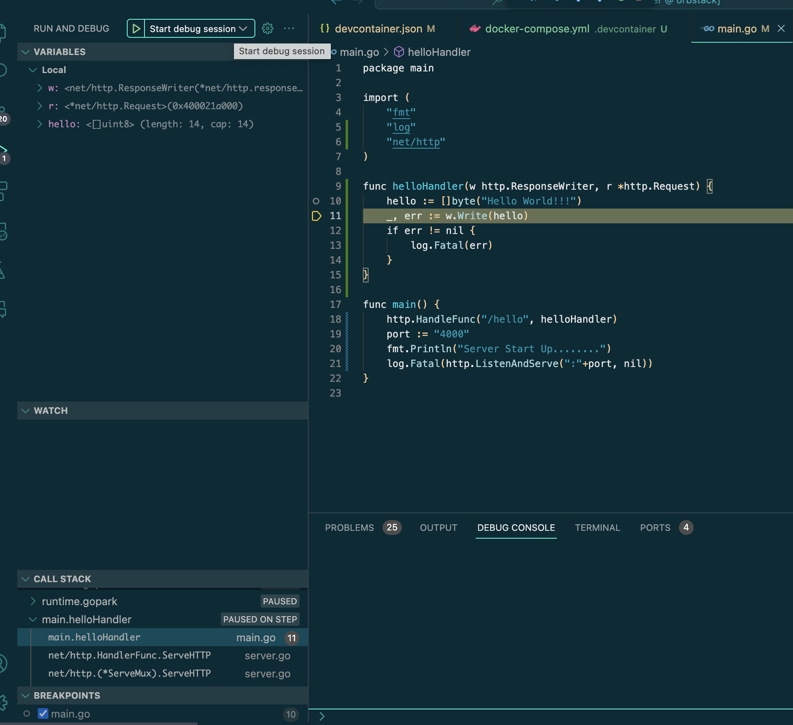

# 使い方
1.  既存でdocker composeでコンテナ立ててたらdownする
2. `vscode/golang/devcontainer.json` を`devcontainer/.devcontainer.json`として配置
3. `vscode/golang/launch.json` を`.vscode/launch.json`として配置
4. `vscode/golang/docker-compose.yml`を`devcontainer/docker-compose.yml`として配置
5. `devcontainer/.devcontainer.json`、`.vscode/launch.json`、`devcontainer/docker-compose.yml`を書き換えて、デバッグ対象のサービスを指定する
6. Reopen in Containerでデバッグ対象のコンテナに接続してVSCodeを開く
7. Run and Debugからdebugger clientを起動してdebug開始

